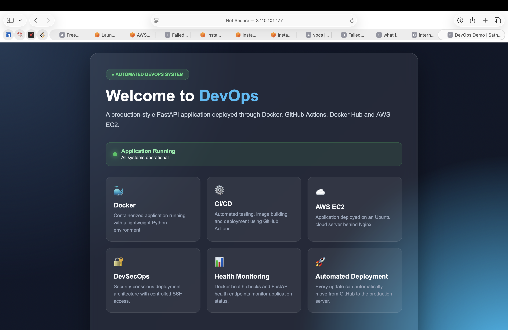
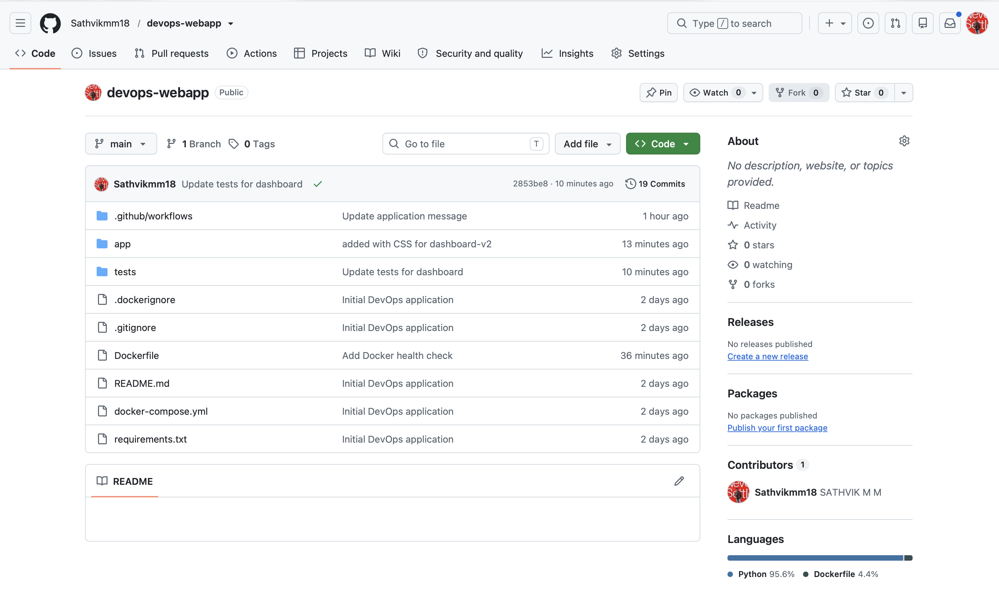
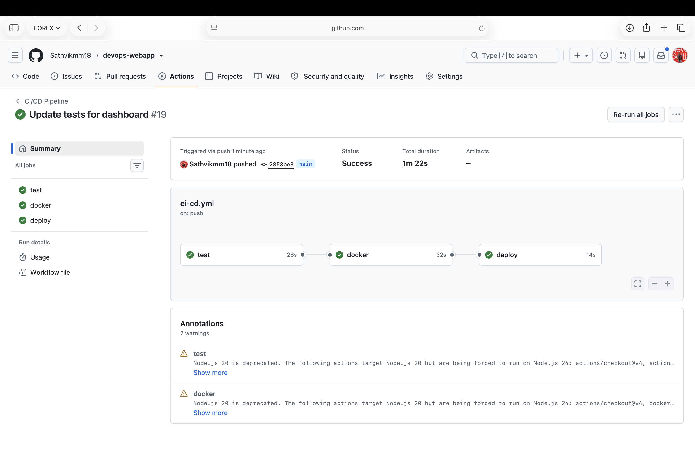
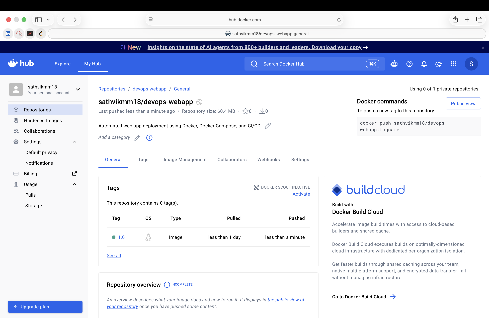
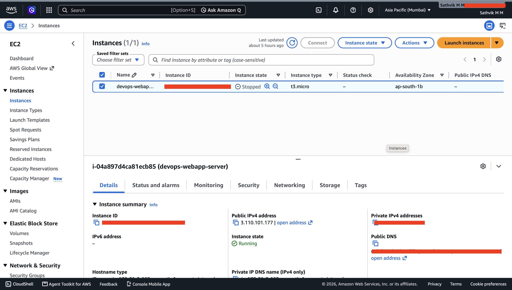
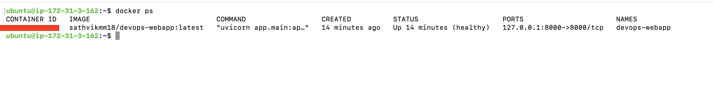
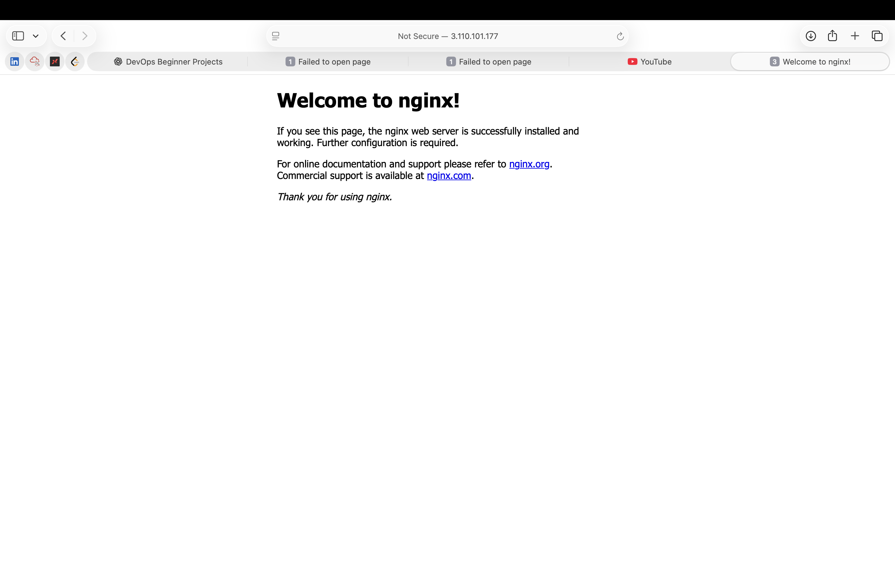

# 🚀 Automated DevOps Web Application

[](https://github.com/Sathvikmm18/devops-webapp/actions/workflows/ci-cd.yml)

A production-style **FastAPI DevOps application** demonstrating automated testing, Docker containerization, Docker Hub integration, GitHub Actions CI/CD, AWS EC2 deployment, and Nginx reverse proxy.

---

## 📌 Project Overview

This project demonstrates an end-to-end automated deployment workflow:

```text
Developer
    ↓
GitHub
    ↓
GitHub Actions
    ↓
Pytest
    ↓
Docker Build
    ↓
Docker Hub
    ↓
AWS EC2
    ↓
Docker Container
    ↓
Nginx
    ↓
FastAPI Application
````

Every push to the `main` branch automatically tests, builds, publishes, and deploys the application.

---

## 🏗️ Architecture

```text
                 ┌───────────────┐
                 │   Developer   │
                 └───────┬───────┘
                         │
                      git push
                         ↓
                 ┌───────────────┐
                 │    GitHub     │
                 └───────┬───────┘
                         ↓
                 ┌───────────────┐
                 │GitHub Actions │
                 └───────┬───────┘
                         │
              ┌──────────┴──────────┐
              ↓                     ↓
          ┌─────────┐          ┌─────────┐
          │  Pytest │          │  Docker │
          └─────────┘          └────┬────┘
                                    ↓
                              ┌───────────┐
                              │Docker Hub │
                              └─────┬─────┘
                                    ↓
                              ┌───────────┐
                              │  AWS EC2  │
                              └─────┬─────┘
                                    ↓
                                Docker
                                    ↓
                                Nginx
                                    ↓
                              FastAPI App
```

---

## 🛠️ Technologies

| Category         | Technologies                             |
| ---------------- | ---------------------------------------- |
| Backend          | Python, FastAPI, Uvicorn                 |
| Testing          | Pytest                                   |
| Containerization | Docker, Docker Compose                   |
| CI/CD            | GitHub Actions                           |
| Registry         | Docker Hub                               |
| Cloud            | AWS EC2                                  |
| Web Server       | Nginx                                    |
| OS               | Ubuntu Linux                             |
| Security         | SSH, GitHub Secrets, AWS Security Groups |

---

## 📁 Project Structure

```text
devops-webapp/
│
├── app/
│   └── main.py
│
├── tests/
│   └── test_main.py
│
├── .github/
│   └── workflows/
│       └── ci-cd.yml
│
├── docs/
│   ├── architecture.png
│   └── screenshots/
│       ├── 01-application.png
│       ├── 02-github-repository.png
│       ├── 03-github-actions.png
│       ├── 04-docker-hub.png
│       ├── 05-aws-ec2.png
│       ├── 06-docker-container.png
│       ├── 07-nginx.png
│       └── 08-final-deployment.png
│
├── Dockerfile
├── docker-compose.yml
├── requirements.txt
└── README.md
```

---

## 💻 Local Setup

### Clone the repository

```bash
git clone https://github.com/Sathvikmm18/devops-webapp.git
cd devops-webapp
```

### Create virtual environment

```bash
python3 -m venv venv
source venv/bin/activate
```

### Install dependencies

```bash
pip install -r requirements.txt
```

### Run application

```bash
uvicorn app.main:app --reload
```

Open:

```text
http://localhost:8000
```

API documentation:

```text
http://localhost:8000/docs
```

---

## 🧪 Testing

Run:

```bash
python -m pytest
```

Expected:

```text
3 passed
```

The tests validate:

* Application dashboard
* Health endpoint
* Version endpoint

---

## 🐳 Docker

### Build

```bash
docker build -t devops-webapp .
```

### Run

```bash
docker run -d \
  --name devops-webapp \
  -p 8000:8000 \
  --restart unless-stopped \
  devops-webapp
```

Check:

```bash
docker ps
```

The container includes a Docker health check using:

```text
/health
```

---

## 🔄 CI/CD Pipeline

The GitHub Actions pipeline performs:

```text
Git Push
   ↓
Run Tests
   ↓
Build Docker Image
   ↓
Login to Docker Hub
   ↓
Push Docker Image
   ↓
SSH into AWS EC2
   ↓
Pull Latest Image
   ↓
Stop Old Container
   ↓
Start New Container
   ↓
Deployment Complete
```

Pipeline jobs:

```text
test      ✅
docker    ✅
deploy    ✅
```

---

## ☁️ AWS Deployment

The application runs on an Ubuntu AWS EC2 instance.

```text
Internet
   ↓
AWS EC2 :80
   ↓
Nginx
   ↓
Docker :8000
   ↓
FastAPI
```

Nginx acts as a reverse proxy, allowing users to access the application through standard HTTP port `80`.

---

## 🔐 Secrets & Security

GitHub Actions uses encrypted repository secrets:

```text
DOCKER_USERNAME
DOCKER_PASSWORD
EC2_HOST
EC2_USERNAME
EC2_SSH_KEY
```

Security practices:

* Docker Hub Personal Access Token instead of password
* SSH private key stored only in GitHub Secrets
* No credentials committed to Git
* AWS Security Groups used for network access
* Docker application port is internally exposed through Nginx

> Never commit passwords, tokens, private keys, or `.pem` files to the repository.

---

## 🔌 API Endpoints

| Endpoint   | Description                   |
| ---------- | ----------------------------- |
| `/`        | Application dashboard         |
| `/health`  | Health check                  |
| `/version` | Application version           |
| `/docs`    | FastAPI Swagger documentation |

Example health response:

```json
{
  "status": "healthy"
}
```

---

## 📸 Screenshots

### Application Dashboard



### GitHub Repository



### GitHub Actions



### Docker Hub



### AWS EC2



### Docker Container



### Nginx



### Final Deployment


---

## 📈 Future Improvements

* HTTPS with Let's Encrypt
* Custom domain
* Prometheus & Grafana monitoring
* Trivy container scanning
* SonarQube code analysis
* Terraform infrastructure
* AWS ECR
* AWS ECS/EKS
* Blue-Green deployment
* Automated rollback
* Centralized logging
* AWS Secrets Manager

---

## 🎯 DevOps Skills Demonstrated

* Git & GitHub
* GitHub Actions
* CI/CD
* Python & FastAPI
* Pytest
* Docker
* Docker Hub
* Linux & Ubuntu
* AWS EC2
* Nginx
* SSH
* Secrets Management
* Container Health Checks
* Automated Cloud Deployment
* DevSecOps Fundamentals

---

## 👨‍💻 Author

**Sathvik M M**
DevSecOps Engineer

GitHub:
[https://github.com/Sathvikmm18](https://github.com/Sathvikmm18)

---

⭐ **If you found this project useful, consider giving the repository a star.**

````

